npm install 
-Khởi chạy server App : node app.js

ĐĂNG KÝ trường hợp thành công
Method: POST
URL: http://localhost:3000/auth/register
Body (x-www-form-urlencoded): 
Data
username: admin
password: 12345
Kết quả: 
<h2>Login</h2>
<form action="/login" method="POST">
  <input type="text" name="username" placeholder="Username" required /> 
  <input type="password" name="password" placeholder="Password" required /> 
  <button type="submit">Login</button>
</form>
<a href="/register">Register</a>

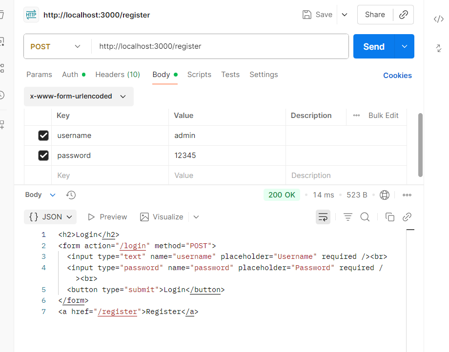
check in website
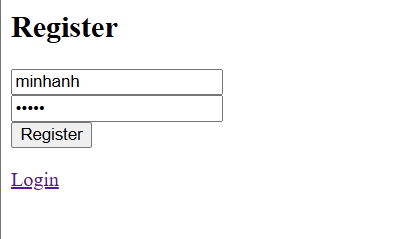
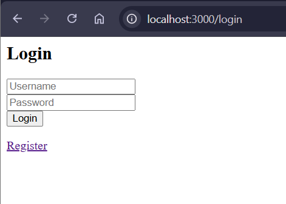
Check in Database
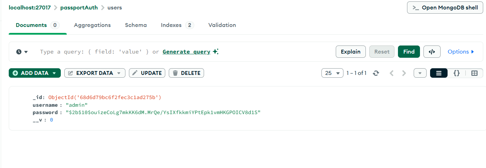
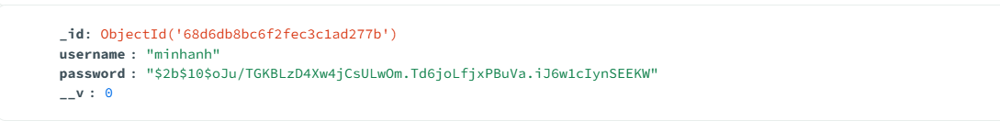
==============================================
ĐĂNG KÝ trường hợp không thành công
Method: POST
URL: http://localhost:3000/auth/register
Body (x-www-form-urlencoded): 
Data:
username: admin
password: 12345

Kết quả: 
Error: E11000 duplicate key error collection: passportAuth.users index: username_1 dup key: { username: "admin" }

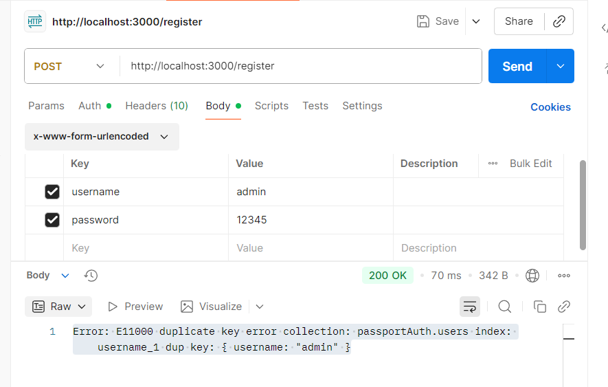
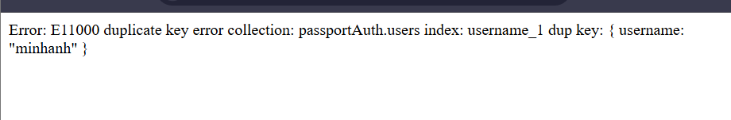

==============================================
Đăng nhập thành công
Method: POST
URL: http://localhost:3000/login
Body: x-www-form-urlencoded
Data:
username: admin
password: 12345
Kết quả: 
<h2>Welcome admin</h2>
<a href="/logout">Logout</a>

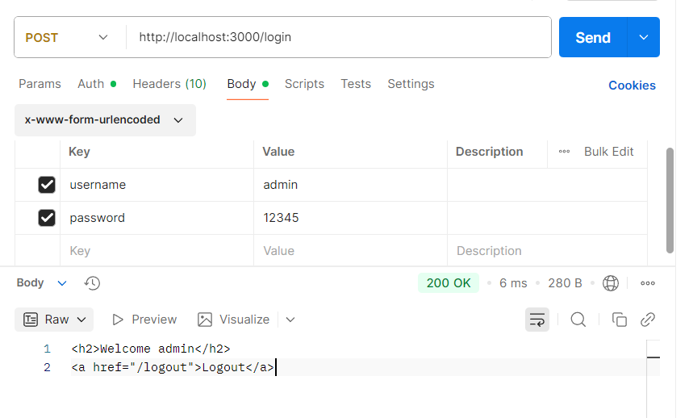
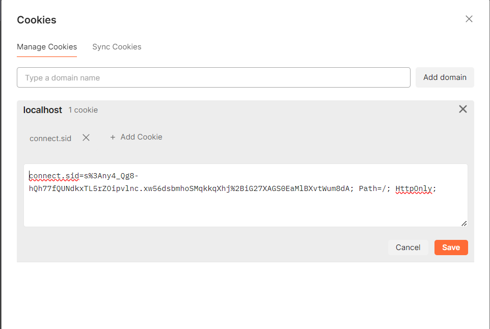
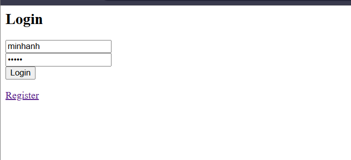
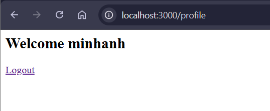

==============================================
Đăng nhập không thành công
Method: POST
URL: http://localhost:3000/login
Body: x-www-form-urlencoded
Data:
username: admin
password: 123456
Kết quả: 
<h2>Login</h2>
<form action="/login" method="POST">
  <input type="text" name="username" placeholder="Username" required /> 
  <input type="password" name="password" placeholder="Password" required /> 
  <button type="submit">Login</button>
</form>
<a href="/register">Register</a>

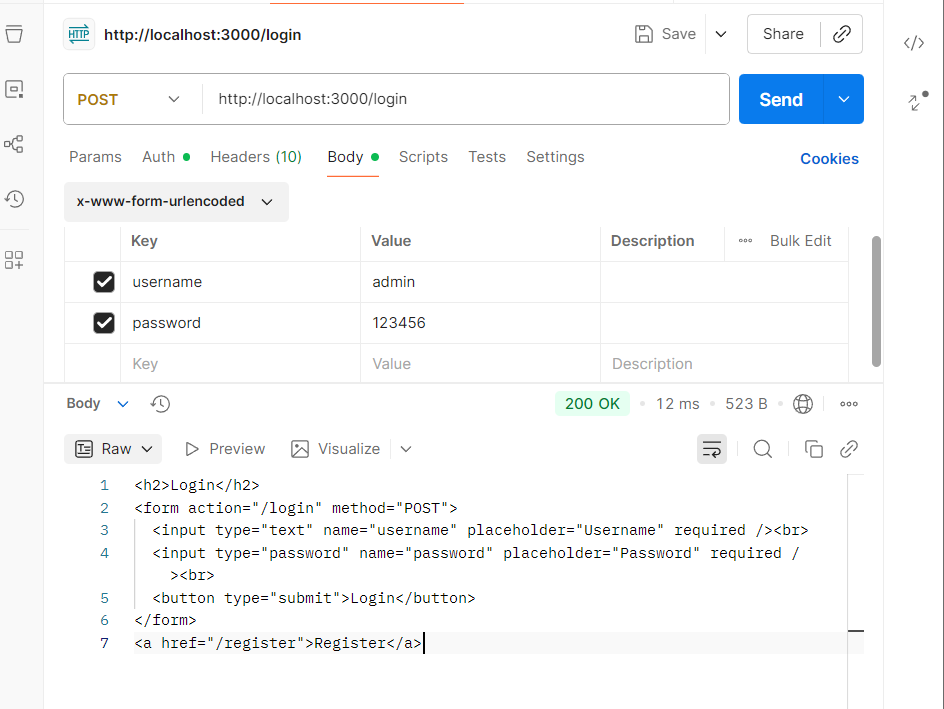
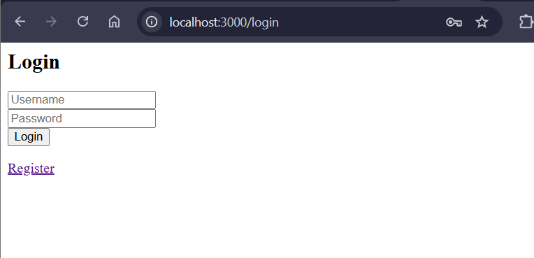
==============================================
Truy cập profile
Method: GET
URL: http://localhost:3000/profile
Kết quả: 
<h2>Welcome admin</h2>
<a href="/logout">Logout</a>

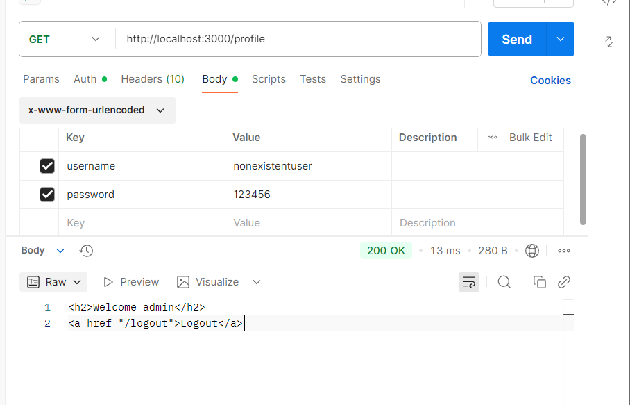

==============================================
Đăng xuất
Method: GET
URL: http://localhost:3000/logout
kết quả:
<h2>Login</h2>
<form action="/login" method="POST">
  <input type="text" name="username" placeholder="Username" required /> 
  <input type="password" name="password" placeholder="Password" required /> 
  <button type="submit">Login</button>
</form>
<a href="/register">Register</a>

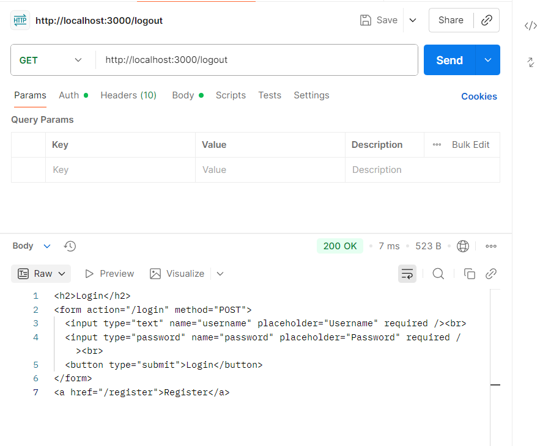

==============================================
Truy cập profile sau khi logout
Method: GET 
URL: http://localhost:3000/profile
Kết quả: 
<h2>Login</h2>
<form action="/login" method="POST">
  <input type="text" name="username" placeholder="Username" required /> 
  <input type="password" name="password" placeholder="Password" required /> 
  <button type="submit">Login</button>
</form>
<a href="/register">Register</a>

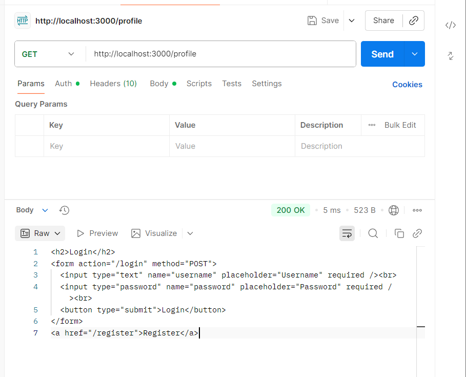

